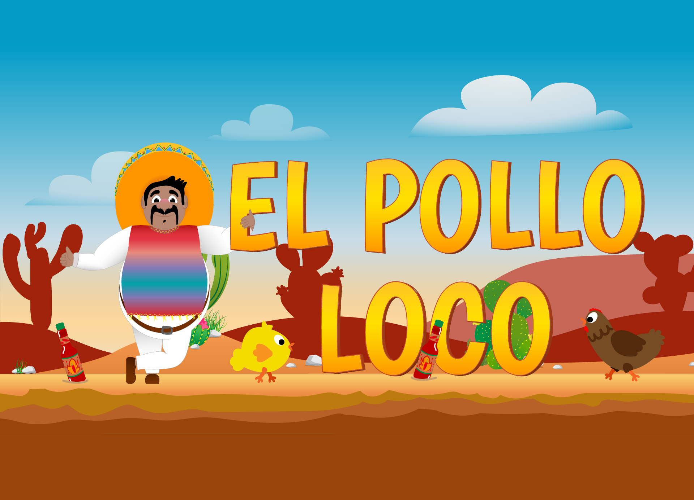
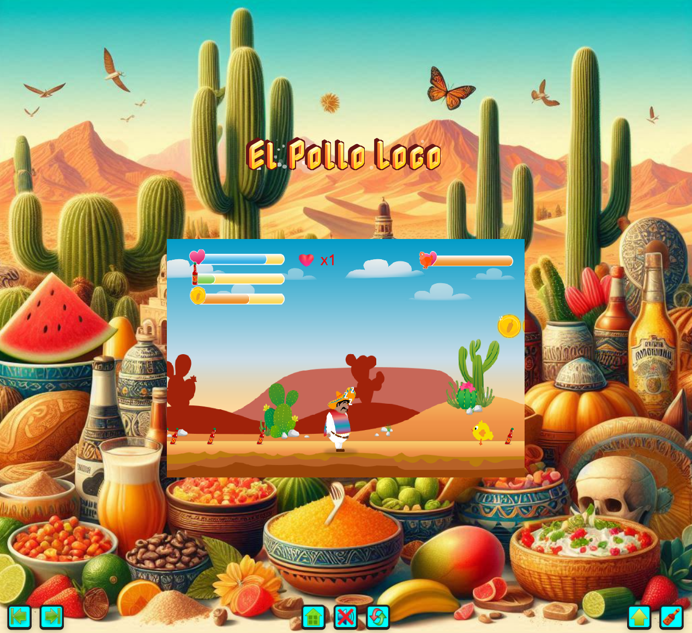
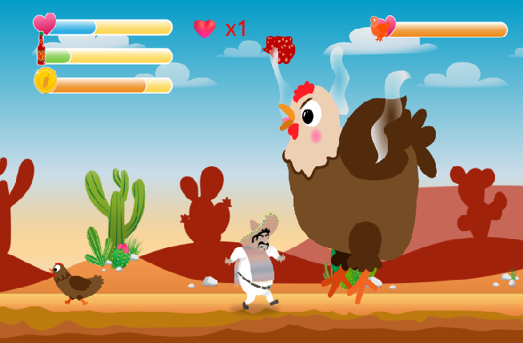
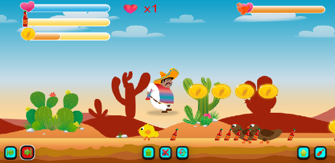

# 🐔 El Pollo Loco - JavaScript Adventure Game

<div align="center">



**A thrilling 2D platform adventure game built with vanilla JavaScript and HTML5 Canvas**

[](#)
[](https://developer.mozilla.org/en-US/docs/Web/JavaScript)
[](https://developer.mozilla.org/en-US/docs/Web/API/Canvas_API)

[🎮 Play Game](#-quick-start) • [📋 Features](#-features) • [🛠️ Tech Stack](#️-tech-stack) • [🚀 Installation](#-installation) • [📱 Controls](#-controls)

</div>

---

## 🎯 **Game Overview**

**El Pollo Loco** is a vibrant 2D platform adventure where you play as Pepe, a brave character on a mission to defeat the evil Endboss chicken and save the day! Navigate through challenging levels, collect coins and bottles, and use your skills to overcome enemies in this action-packed adventure.

### 🌟 **What Makes This Special**

- **🎨 Pure Vanilla JavaScript** - No frameworks, just raw performance
- **📱 Cross-Platform** - Seamless desktop and mobile experience  
- **🎵 Dynamic Audio** - Immersive sound design with intelligent audio pooling
- **⚡ Optimized Performance** - 60fps smooth gameplay with efficient collision detection
- **🏗️ Enterprise Architecture** - Clean, scalable, and maintainable codebase

---

## 🎮 **Features**

<table>
<tr>
<td width="50%">

### 🎯 **Gameplay Features**
- ✅ **Multiple Enemy Types** - Chickens, Small Chickens, and Epic Endboss
- ✅ **Combat System** - Jump attacks and throwable bottle weapons
- ✅ **Collectibles** - Coins for extra lives, bottles for ammunition
- ✅ **Health System** - Dynamic health bars for player and boss
- ✅ **Progressive Difficulty** - Increasingly challenging enemy spawns
- ✅ **Boss Battle** - Epic final confrontation with unique mechanics

</td>
<td width="50%">

### 🔧 **Technical Features**
- ✅ **Responsive Design** - Adapts to any screen size
- ✅ **Touch Controls** - Native mobile support
- ✅ **Audio Management** - Advanced sound pooling system
- ✅ **Memory Optimization** - Efficient resource cleanup
- ✅ **Collision Detection** - Precise hitbox calculations
- ✅ **Animation Engine** - Smooth sprite-based animations

</td>
</tr>
</table>

---

## 🎬 **Game Preview**

<div align="center">

### 🎮 **Gameplay Screenshots**

<table>
<tr>
<td align="center">

<br/><sub><b>Main Gameplay</b></sub>
</td>
<td align="center">

<br/><sub><b>Epic Boss Battle</b></sub>
</td>
<td align="center">

<br/><sub><b>Mobile Interface</b></sub>
</td>
</tr>
</table>

### 🎥 **Live Demo**
*Experience the full game in action!*

[](https://github.com/MihaelaAghirculesei)

</div>

---

## 🛠️ **Tech Stack**

<div align="center">

| Frontend | Audio | Tools | Architecture |
|----------|-------|-------|--------------|
|  |  |  |  |
|  |  |  |  |
|  |  |  |  |

</div>

### 🏗️ **Architecture Highlights**

```javascript
📁 Project Structure
├── 🎮 models/           # Game entities (Character, Enemies, World)
├── 🎵 audio/            # Sound effects and music
├── 🎨 img_pollo_locco/  # Game assets and sprites  
├── 🛠️ js/              # Core game logic and utilities
├── 📱 css/             # Responsive styling
└── 🌐 index.html       # Entry point
```

---

## 🚀 **Installation**

### 🔥 **Quick Start**

```bash
# Clone the repository
git clone https://github.com/MihaelaAghirculesei/el-pollo-loco.git

# Navigate to project directory
cd el-pollo-loco

# Open in your preferred development environment
code .

# Launch with live server (VS Code extension) or any local server
# No build process needed - pure vanilla JS!
```

### 🌐 **Live Server Setup**

1. **VS Code**: Install "Live Server" extension → Right-click `index.html` → "Open with Live Server"
2. **Python**: `python -m http.server 8000`
3. **Node.js**: `npx live-server`

### 📦 **No Dependencies Required!**
This game runs on **pure vanilla JavaScript** - no npm install, no build process, just open and play!

---

## 📱 **Controls**

<div align="center">

### 🖥️ **Desktop Controls**
| Action | Key |
|--------|-----|
| Move Left | ← Arrow Key |
| Move Right | → Arrow Key |
| Jump | Spacebar |
| Throw Bottle | D |

### 📱 **Mobile Controls**
| Action | Control |
|--------|---------|
| Move | Touch directional buttons |
| Jump | Tap jump button |
| Throw | Tap throw button |
| Audio | Tap sound toggle |

</div>

---

## 🎯 **Game Mechanics**

### 🏃‍♂️ **Character System**
- **Health**: 100 HP with visual health bar
- **Lives**: Start with 1 life, earn more by collecting 30 coins
- **Movement**: Smooth physics with gravity and collision detection
- **States**: Idle, walking, jumping, hurt, and sleeping animations

### ⚔️ **Combat System**
- **Jump Attacks**: Land on enemies to defeat them
- **Projectiles**: Throw bottles to damage enemies from distance
- **Boss Mechanics**: Multi-phase battle with unique attack patterns

### 💰 **Collectibles**
- **Coins**: Collect 30 to earn an extra life
- **Bottles**: Ammunition for ranged attacks
- **Visual Feedback**: Animated collection effects with sound

### 🎵 **Audio Experience**
- **Dynamic Music**: Background music with boss battle themes
- **Sound Effects**: Unique sounds for every action
- **Audio Pooling**: Lag-free sound playback
- **Mute Toggle**: Full audio control

---

## 🧠 **Technical Deep Dive**

### ⚡ **Performance Optimizations**

```javascript
// Audio Pooling for Lag-Free Sound
createAudioPool(path, poolSize = 3) {
  const pool = { instances: [], currentIndex: 0 };
  for (let i = 0; i < poolSize; i++) {
    pool.instances.push(this.createAudioInstance(path, 0.2));
  }
  this.audioPool[path] = pool;
}

// Efficient Collision Detection
function isCollidingWithEnemy(character, enemy) {
  const charMargin = 20, enemyMargin = 15;
  // Optimized AABB collision with margins
  return charRight > enemyLeft && charLeft < enemyRight && 
         charBottom > enemyTop && charTop < enemyBottom;
}

// Memory Management
filterMarkedObjects(objectArray) {
  return objectArray.filter(obj => !obj.markedForRemoval);
}
```

### 🏗️ **Object-Oriented Design**

```javascript
// Clean Inheritance Hierarchy
DrawableObject → MovableObject → Character
                               → Enemies (Chicken, SmallChicken, Endboss)
                               → Collectibles (Coin, Bottle)
```
### 📱 **Responsive Architecture**

- **Mobile Detection**: Automatic touch control activation
- **Orientation Handling**: Smart landscape mode recommendations  
- **Dynamic UI**: Adaptive button layouts
- **Performance Scaling**: Optimized for various device capabilities

---

## 🎨 **Assets & Credits**

### 🎭 **Game Assets**
- **Character Sprites**: Pepe character with multiple animation states
- **Enemy Design**: Chicken family with unique behaviors
- **Environment**: Dynamic backgrounds and game elements
- **UI Elements**: Clean game interface components

### 🎵 **Audio Design**
- **Background Music**: Adventure-themed soundtrack
- **Sound Effects**: Audio feedback for game interactions
- **Audio System**: Integrated sound management

---

## 🔧 **Development**

### 📋 **Code Quality Standards**
- ✅ **JSDoc Documentation**: Complete function documentation
- ✅ **Modular Architecture**: Clean separation of concerns
- ✅ **Performance Optimized**: 60fps stable gameplay
- ✅ **Memory Efficient**: Proper resource cleanup
- ✅ **Error Handling**: Robust error management
- ✅ **Cross-Browser**: Compatible with all modern browsers

### 🧪 **Development Approach**
- **Iterative Development**: Feature-by-feature implementation
- **Performance Focus**: Frame rate and responsiveness optimization
- **Cross-Platform Testing**: Desktop and mobile compatibility
- **Code Review**: Regular code quality improvements

---

## 🤝 **Contributing**

We welcome contributions! Here's how you can help:

1. **🍴 Fork the repository**
2. **🌿 Create your feature branch**: `git checkout -b feature/AmazingFeature`
3. **💬 Commit your changes**: `git commit -m 'Add some AmazingFeature'`
4. **📤 Push to the branch**: `git push origin feature/AmazingFeature`
5. **🔄 Open a Pull Request**

### 💡 **Ideas for Contributions**
- 🎯 New enemy types and behaviors
- 🗺️ Additional levels and environments  
- 🎵 More sound effects and music
- 📱 Enhanced mobile controls
- 🌍 Internationalization support

---

## 📈 **Performance Highlights**

<div align="center">

| Metric | Performance |
|--------|-------------|
| **Frame Rate** | Smooth 60 FPS |
| **Load Time** | Fast startup |
| **Memory Usage** | Lightweight |
| **Dependencies** | Zero external libs |
| **Mobile Support** | ✅ Full compatibility |

</div>

## 🎖️ **Achievements**

<div align="center">

| 🏆 **Technical Excellence** | 🎮 **Game Design** | 🎨 **User Experience** |
|------------------------------|-------------------|-------------------------|
| ✅ Zero external dependencies | ✅ Engaging gameplay loop | ✅ Intuitive controls |
| ✅ Vanilla JS mastery | ✅ Progressive difficulty | ✅ Responsive design |
| ✅ Optimized performance | ✅ Satisfying mechanics | ✅ Professional UI/UX |
| ✅ Clean architecture | ✅ Immersive audio | ✅ Cross-platform support |

</div>

---

## 📞 **Contact & Links**

<div align="center">

[](#)
[](https://www.linkedin.com/in/mihaela-aghirculesei-84147a23b/)
[](kontakt@mihaela-melania-aghirculesei.de)

**Built with ❤️ and lots of ☕ by Mihaela Melania Aghirculesei**

</div>

---


<div align="center">

### 🌟 **If you enjoyed this game, please give it a star!** ⭐

**Thank you for playing El Pollo Loco!** 🐔🎮

*Made with passion for the art of game development*

</div>
