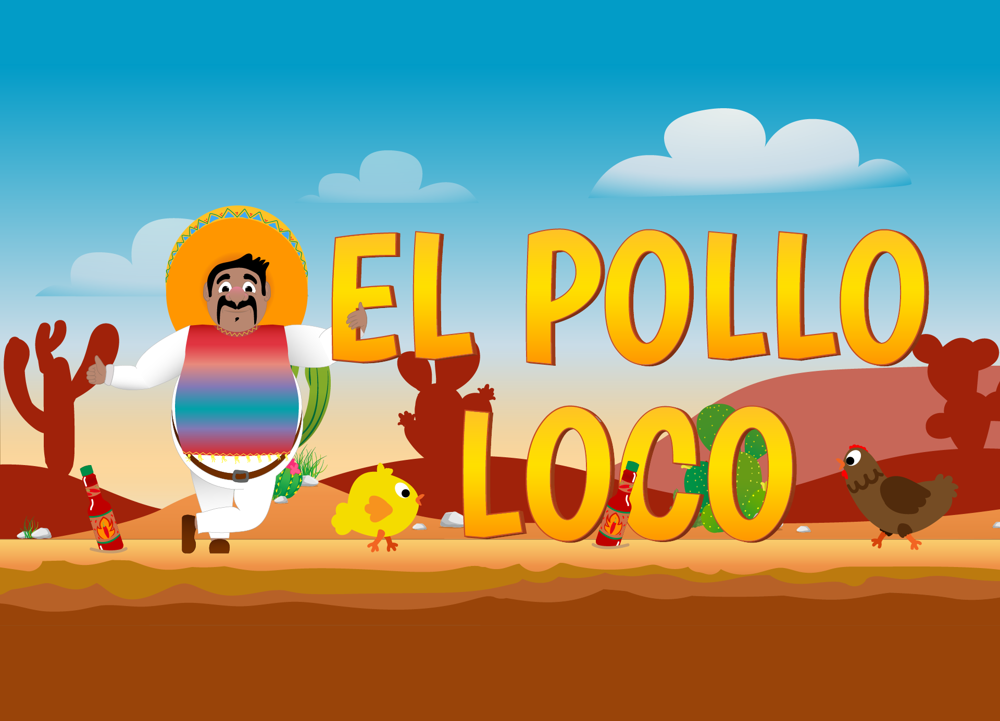
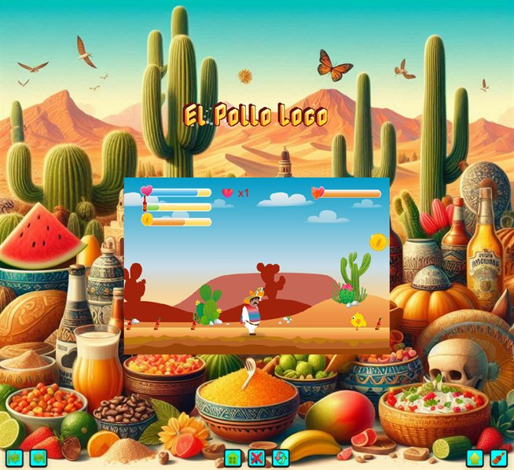
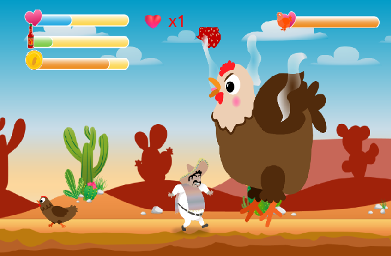
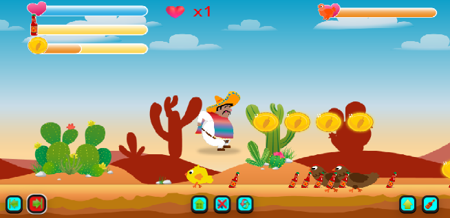

# 🐔 El Pollo Loco

<div align="center">



**A 2D jump-'n'-run built from scratch on the HTML5 Canvas 2D API — no game engine, no rendering library, zero runtime dependencies. Class-based OOP, ~60 FPS, mobile touch controls.**

[](https://el-pollo-loco-aghirculesei.pages.dev/)
[](https://developer.mozilla.org/en-US/docs/Web/JavaScript)
[](https://developer.mozilla.org/en-US/docs/Web/API/Canvas_API)
[](#license)

</div>

---

## Table of Contents

- [About](#about)
- [Screenshots](#screenshots)
- [Features](#features)
- [Controls](#controls)
- [Gameplay & Mechanics](#gameplay--mechanics)
- [Tech Stack](#tech-stack)
- [Architecture](#architecture)
- [Performance & Resource Management](#performance--resource-management)
- [Security & Deployment](#security--deployment)
- [Getting Started](#getting-started)
- [Development](#development)
- [Project Structure](#project-structure)
- [Roadmap](#roadmap)
- [Credits](#credits)
- [License](#license)
- [Contact](#contact)

---

## About

You play as **Pepe**, a villager whose quiet Mexican town is overrun by a flock of wild chickens.
Run and jump across a parallax-scrolled desert, stomp the chickens, collect coins and salsa
bottles, and take down the giant **Endboss** chicken guarding the far end of the level.

The project is a study in building a complete game loop — physics, collision detection,
sprite animation, an enemy state machine, an audio system and a responsive touch UI — using
only the platform: plain classes, `<canvas>` 2D drawing and `requestAnimationFrame`.

| | |
|---|---|
| **Play** | <https://el-pollo-loco-aghirculesei.pages.dev/> |
| **Canvas** | 720 × 480 game view + a 720 × 100 animated title canvas |
| **Runtime dependencies** | none |
| **Build step** | none required to run; an optional static-copy build for deployment |
| **Hosting** | Cloudflare Pages |

---

## Screenshots

<div align="center">

| Gameplay | Boss fight | Mobile layout |
|:---:|:---:|:---:|
|  |  |  |

</div>

---

## Features

### Gameplay

- **Three enemy types** — regular chickens (2 HP), small chickens (1 HP, faster and smaller) and the Endboss (200 HP).
- **Two ways to fight** — jump on a chicken to defeat it, or collect salsa bottles and throw them at range.
- **Endboss state machine** — walk → alert → attack sequence, then a close-range lunge/jump once Pepe gets near.
- **Collectibles** — coins (30 grant an extra life, with an on-screen popup) and bottles (throwing ammo).
- **Four status bars** — Pepe's health, the Endboss's health, coin count and bottle count.
- **Idle behaviour** — Pepe drifts to an idle animation after 3 s without input and falls asleep (with a snoring loop) after 6 s.
- **Continuous enemy pressure** — new chickens respawn every 5 s up to 10 on screen at once.
- **Win / lose flow** — dedicated game-over and "You Won!" screens with their own audio cues.

### Technical

- **Class-based OOP** with a shared `DrawableObject → MovableObject` inheritance chain.
- **Custom physics** — gravity, jump impulses and ground handling on a fixed-step loop.
- **Layered collision detection** — separate axis-aligned tests, tuned per interaction (character↔enemy, bottle↔enemy, character↔collectible), with per-enemy damage cooldowns.
- **Parallax scrolling** — multi-layer background repeated across an ~8-screen-wide level, plus animated clouds and a particle effect behind the title.
- **Audio system** — background music, boss-fight music, per-action sound effects, round-robin audio pooling for frequently played sounds and a mute state persisted to `localStorage`.
- **Responsive & touch-ready** — on-screen controls appear automatically on touch devices, with a "rotate to landscape" prompt in portrait.
- **Deterministic teardown** — every interval and timeout is cleared when a round ends or the player restarts, so nothing runs behind the end screen.
- **Security headers & CSP** shipped with the deployment (see [Security & Deployment](#security--deployment)).
- **Lint-clean** against a custom ESLint 10 flat config; every class and function carries JSDoc.

---

## Controls

### Keyboard

| Action | Key |
|---|---|
| Move left / right | `←` / `→` |
| Jump | `Space` |
| Throw bottle | `D` |

### Touch (mobile / tablet)

On-screen buttons are shown automatically on touch devices: **left**, **right**, **jump**,
**throw**, plus **home**, **sound toggle** and **play again**. A full-screen overlay asks the
player to rotate to landscape while the device is in portrait.

---

## Gameplay & Mechanics

### Pepe

| Property | Value |
|---|---|
| Health | 100, −20 per hit (5 hits to lose a life) |
| Lives | starts at 1; +1 for every 30 coins collected |
| Move speed | 5 px/step |
| Jump | impulse of 30, resolved by the gravity loop |
| Animations | walk, jump, hurt, dead, idle, long-idle (sleep) |

### Enemies

| Enemy | Health | Notes |
|---|---|---|
| Chicken | 2 | walks left; defeated by a jump attack or a bottle |
| Small chicken | 1 | smaller, faster variant (subclass of `Chicken`) |
| Endboss | 200 | 25 damage per bottle hit (8 hits); walk / alert / attack states + lunge jump |

### Combat & items

- **Jump attack** — landing on a chicken while falling defeats it and bounces Pepe.
- **Bottles** — thrown in the facing direction; a forward throw travels faster than a backward one. A bottle shatters on visible contact with an enemy or when it hits the ground.
- **Coins** — collecting 30 awards an extra life and shows a congratulations popup; the coin bar then resets.

### Audio

Background track, a separate boss-fight track, and effects for hits, collecting, jumping,
the new-life reward, winning and losing. Frequently triggered effects are played from a small
pool of pre-created `Audio` elements to avoid restart latency. The mute setting is stored in
`localStorage`, so it persists across sessions.

---

## Tech Stack

| Area | Choice |
|---|---|
| Language | JavaScript (ES2022), `type="module"` entry point |
| Rendering | HTML5 Canvas 2D API + `requestAnimationFrame` |
| Audio | `HTMLAudioElement` (`new Audio(...)`) with a custom pooling layer |
| Styling | Hand-written CSS (`style.css`, `impressum.css`), self-hosted fonts |
| Persistence | `localStorage` for the mute setting |
| Tooling | ESLint 10 (flat config), npm scripts |
| Hosting / CI | Cloudflare Pages with a `_headers` config |

No frameworks, bundlers or transpilers are used.

---

## Architecture

### Class hierarchy

```
DrawableObject                     draw + shared image pool
├── MovableObject                  physics, movement, hit/health, animation
│   ├── Character                  Pepe: input, state machine, camera
│   ├── Endboss                    boss AI state machine
│   ├── Chicken                    walking enemy
│   │   └── SmallChicken           faster/smaller variant
│   ├── Bottle                     collectible bottle in the level
│   ├── ThrowableObject            bottle in flight (rotation + splash)
│   ├── Cloud                      background cloud
│   └── BackgroundObjekt           parallax background layer
├── CollectableObject
│   └── Coin
├── StatusBarHeartCharacter
├── StatusBarHeartEndboss
├── StatusBarBottle
└── StatusBarCoins
```

### Runtime

- **`World`** builds the level (`buildLevel1()`), owns every entity and runs a single `requestAnimationFrame` loop. Each frame it:
  - advances the **game logic** — boss activation, collision resolution, bottle throwing, item collection and the win/lose check — in fixed 35 ms steps drawn from a delta-time accumulator, so the simulation stays frame-rate independent and a backgrounded tab can't burst-catch-up (the per-frame delta is clamped);
  - **renders** — clear the canvas, apply the camera translation, redraw every entity and status bar.
- **`Character`** runs its own input, state (active / idle / sleeping) and animation intervals.
- **`Endboss`** runs a state-machine interval (walking / alert / attack / jump).
- **Script loading** — every class and helper is loaded as a classic `<script>` sharing global scope; `js/game.js` and `models/world.class.js` are the only ES modules. This is deliberate and is encoded in the ESLint config's `globals` list.

---

## Performance & Resource Management

- **Shared image pool** — `DrawableObject.imagePool` decodes each sprite once and hands the same `Image` to every instance that needs it. A throwaway level is built at page load to start that decoding immediately, and pressing *Play* waits for the pooled sprites to finish decoding before the world is built, so the first rendered frame never stalls on a cold decode.
- **In-place restart** — *Play Again* tears the finished world down and builds a fresh one without reloading the page, so the decoded image pool carries straight into the next run.
- **Lazy level animation** — clouds, coins and bottles stay still on the start screen and only begin animating when a game actually starts.
- **Full teardown on game end** — `World.stopAllLoops()` sets the flag that ends the `requestAnimationFrame` loop, clears the spawn timer and calls `stop()` on every entity to kill its own intervals and timeouts (`Character.stop()`, `Endboss.stop()`, `Chicken.stop()`, `ThrowableObject.stop()`), so no work happens behind the end screen or after a restart.
- **Throttled resize handling** — orientation checks are coalesced through `requestAnimationFrame`.
- **Render loop** targets the display refresh rate (typically 60 FPS) and stops immediately when `gameOver` is set.

---

## Security & Deployment

Deployed on **Cloudflare Pages**. The `_headers` file applies, on every response:

| Header | Value |
|---|---|
| `Content-Security-Policy` | `default-src 'self'` with a tight per-directive allow-list and no `'unsafe-inline'` anywhere (`script-src 'self'`, `style-src 'self'`, `object-src 'none'`, `frame-ancestors 'none'`, …) |
| `X-Frame-Options` | `DENY` |
| `X-Content-Type-Options` | `nosniff` |
| `Referrer-Policy` | `strict-origin-when-cross-origin` |
| `Permissions-Policy` | geolocation, camera, microphone, payment, USB and FLoC all disabled |
| `Cross-Origin-Opener-Policy` | `same-origin` |

Static assets under `/audio`, `/img_pollo_locco` and `/fonts` are served with
`Cache-Control: public, max-age=31536000, immutable`.

The page also ships SEO and social metadata (`description`, canonical URL, Open Graph and
Twitter card tags) and an SVG favicon.

---

## Getting Started

No build or install is required to run the game — it is static files served over HTTP.

```bash
git clone https://github.com/MihaelaAghirculesei/El-Pollo-Loco.git
cd El-Pollo-Loco
```

Then serve the folder with any static server, for example:

| Tool | Command |
|---|---|
| VS Code | "Live Server" extension → right-click `index.html` → **Open with Live Server** |
| Python | `python -m http.server 8000` |
| Node | `npx serve` (or `npx live-server`) |

Open the printed URL and press **Play**. Opening `index.html` directly from the file system
is not recommended — the ES-module entry point needs an `http://` origin.

---

## Development

```bash
npm install        # dev tooling only (ESLint); not needed to run the game
npm run lint       # ESLint 10, flat config in eslint.config.mjs
npm run build      # copies the static files into dist/ for deployment
```

- **`eslint.config.mjs`** declares the cross-file game globals, treats `js/**`, `models/**`,
  `levels/**` and `fonts/**` as browser scripts, and marks `js/game.js` and
  `models/world.class.js` as ES modules.
- **`npm run build`** is a plain file copy (POSIX shell); run it on macOS/Linux or in CI.
- Every class and function is documented with **JSDoc**.
- `.editorconfig` and the ESLint config define the shared code style.

---

## Project Structure

```
.
├── index.html                 markup, screens, script tags
├── impressum.html             legal notice / privacy page
├── style.css / impressum.css  styling
├── favicon.svg
├── _headers                   Cloudflare Pages security & cache headers
├── eslint.config.mjs          ESLint 10 flat config
├── package.json               scripts + dev dependency (ESLint)
├── js/
│   ├── game.js                entry point (ES module): bootstrap, input, UI wiring
│   └── audio.js               AudioManager: paths, pooling, mute, buttons
├── models/                    all game classes (*.class.js)
├── levels/
│   └── level1.js              enemy / cloud / coin / bottle / background layout
├── fonts/                     self-hosted fonts + particle-background.js
└── img_pollo_locco/img/       sprites, backgrounds, UI, screenshots
```

---

## Roadmap

- Additional levels — `buildLevel1()` already separates the level data from world logic.
- Fold the remaining per-entity animation timers (character, chickens, boss, clouds) into the world's `requestAnimationFrame` loop, so nothing runs on its own `setInterval`.
- Re-compress the screenshot assets used in this README.
- Optional keyboard remapping and a settings screen.

---

## Credits

- **Sprite art & sound effects** — third-party *El Pollo Loco* game assets; not my own work.
- **Fonts** — Michroma, Roboto, Sofia Sans and Nabla, all under the SIL Open Font License (the `OFL.txt` files are bundled under `fonts/`).
- **Code** — Mihaela Melania Aghirculesei.

---

## License

Released under the **MIT License** — see [`LICENSE`](LICENSE).

The bundled fonts keep their own SIL Open Font License; the game sprites and audio are
third-party assets and are not covered by this licence.

---

## Contact

<div align="center">

[](https://aghirculesei.pages.dev/)
[](https://www.linkedin.com/in/mihaela-aghirculesei-84147a23b/)
[](mailto:aghirculesei@gmail.com)
[](https://github.com/MihaelaAghirculesei/El-Pollo-Loco)

Built by **Mihaela Melania Aghirculesei**

</div>
